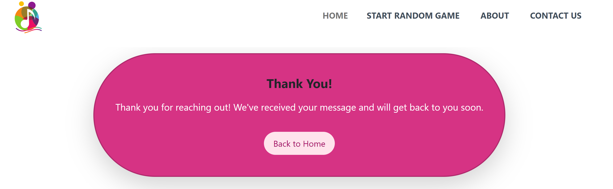
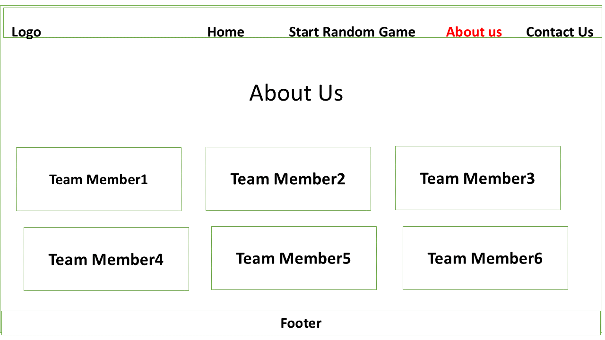

# Hackathon team 5( The String team)

The  String section site  is  Children and biginners' hack  site dedicated  for children  and anyone who want to learn Music while having fun . It features 4 pages, the landing page being the home page. The  start random game page, is a where user can pick game to play randomly( it has memory game section, Piano section and quiz section)  About us page is where  user can read about the coders of this String section site and  contact us page where user can fill form for enquirly


View the live site
[here](https://elamont174.github.io/sept-hackathon24/).


## Features 
### Site wide
#### Navigation Menu
* String Logo, which serves as a link to the index page,  and is responsive at 320px, 600px, and 50em. 1024px

*   This will allow users to easily navigate between the pages within the site on these sizes devices.


#### Hamburger Icon
* At 991 pixel width or below, the navbar will turn into a drop down menu which also features a drop down toggle.


#### Footer
*   This  contain  Sring section Git_Rep icon  that will open in new tabs. Icons will be accessible to the visually impaired who may be using a screen reader, by the use of aria labels. 


### Landing Page
* This page  welcomes the user to the website.


### Random Game Page
* This page  features three sections game


* This section is for Memory game section
* 


* This page is where user text the knowledge about the Music note


This section wehere user learn differrn type of Music Sound


### Contact page
*   This contact form is implemented to allow users to contact 'The String Team' 
*   Username (is a must;  if a user did not input their name, the system will warn that the name must be written)
*   Email (is a must; if the user did not input their email, or input some text without "@", the user will be notified.)


* On a successful submission of the contact form, the user will be navigated to Thank.html displaying a thank you message, and will provide a link back to the home page.




The page feaures what you need to know about  the contrbutors of this site

### Features Left to Implement

* As a future enhancement, the contact form will notify the user that their email was successfully submitted to the team's email account
* There would be dedicated Twitter, youtube, and Facebook handle dedicated to 'String Team'

## Design 

### WireFlame
* At the very beginning of the project, the Scrum Master instructed the Team Members to create a simple wireframe  pages to get creative  flowing. All of which contributed a little bit of something to the final project.

  

#### Start Random Game has three sections; They are
 

 

 

About Us
 

Contact Us
 

### Colour Scheme
We chose the site's colours to mirror the Children color (green, red, yellow, ---).


## Technologies

* HTML5
    * The structure of the Website was developed using HTML as the main language.
* CSS3
    * The Website was styled using custom CSS in an external file.
* JavaScript
    * The website's interactive aspects were contstructed using Javascript in an external file.
* Bootstrap 
    * The Website Navbar was from Bootstrap 5.3.2
* GitHub
    * Source code is hosted on GitHub and delpoyed using Git Pages.
* Git 
    * Used to commit and push code during the development of the Website
* Font Awesome
    * Icons obtained from https://fontawesome.com/ were used as the Social media links in the footer section. 


## Testing 

### Responsiveness

All pages were tested to ensure responsiveness on screen sizes from 320px and upwards as defined in [WCAG 2.1 Reflow criteria for responsive design](https://www.w3.org/WAI/WCAG21/Understanding/reflow.html) on Chrome, Edge, Firefox and Opera browsers.

Steps to test:

1. Open browser and navigate to String
2. Open the developer tools (right click and inspect)
3. Set to responsive and decrease width to 320px
4. Set the zoom to 50%
5. Click and drag the responsive window to maximum width

Expected:

Website is responsive on all screen sizes and no images are pixelated or stretched.
No horizontal scroll is present.
No elements overlap.

Actual:

Website behaved as expected with the exception of switching to landscape . 

Website was also opened on the following devices and no responsive issues were seen:

- Oukitel C21 Pro
- TCL 30 Pro
- iPhone SE
- Samsung Galaxy Tablet

### Accessibility

[Wave Accessibility](https://wave.webaim.org/) tool was used throughout development and for final testing of the deployed website to check for any aid accessibility testing.

Testing was focused to ensure the following criteria were met:

- All forms have associated labels or aria-labels so that this is read out on a screen reader to users who tab to form inputs
- Color contrasts meet a minimum ratio as specified in [WCAG 2.1 Contrast Guidelines](https://www.w3.org/WAI/WCAG21/Understanding/contrast-minimum.html)
- Heading levels are not missed or skipped to ensure the importance of content is relayed correctly to the end user
- All content is contained within landmarks to ensure ease of use for assistive technology, allowing the user to navigate by page regions
- All not textual content had alternative text or titles so descriptions are read out to screen readers
- HTML page lang attribute has been set
- Aria properties have been implemented correctly
- WCAG 2.1 Coding best practices being followed

Manual tests were also performed to ensure the website was accessible as possible and an accessibility issue was identified.

Issue : .....

### Lighthouse Testing

#### Welcome Page


#### Game Page


#### History Page


![Quiz page]


#### Contact Page


### Functional Testing

#### Navigation Links

Testing was performed to ensure all navigation links on the respective pages, navigated to the correct pages as per design. This was done by clicking on the navigation links on each page.

| Navigation Link | Page to Load        |
| --------------- | ---------------     |
| Home                | index.html      |        
| Start Random game   | game.html       |
| About us            | about.html      |
| Contact Us          | contact.html    |

All link navigated to the correct pages as exptected.

**Form Testing**

The form on the  Home page was tested to ensure it functioned as expected when correct data was input and when incorrect data was input. The following test scenarios were covered:

*Scenario*

Steps to test: As expected

1. Navigate to [String - Start Random Game]( https://elamont174.github.io/sept-hackathon24/)

1.Memory Game Section: The user is presented with 6 musical instruments to interact with. The sound that plays depends on the instrument selected. It is functioning as expected.


2.Piano Section: Each note you press plays its corresponding sound. It is working as expected.

3. Quiz Section: Users are expected to answer 10 questions, and at the end of the quiz, the score will be displayed. The user will also have the option to play again or return to the Home page. It is working as expected.


**Footer Social Media Icons / Links**

Testing was performed on the Font Awesome Social Media icons in the footer to ensure that each one opened in a new tab and that each one had a hover affect color.

Each item opened a new tab when clicked as expected and correct hover color was present.

**Contact form**

### Scenario One - Correct Inputs

Steps to test:
### If the user inputs the user name and correct email with email format.
Full Name: team string
Email; abe@teamstring.com
Submit;
on clicking submit, It will navigate the user to Successful Message, 

### Scenario two - blank Inputs

Steps to test:
But  if the user e.g;
Full Name:
Email; uju@gmail.com
Submit;
on clicking submit, there will a message telling the user that name filed must not be empty

### Scenario One - incorrect email Inputs

Steps to test:
But  if the user e.g;
Full Name: Code Silver
Email; gmail.com
Submit;
on clicking submit, there will a message telling the user that email field must contain @ 

### Actual:
Website behaved as expected

### Validator Testing 

- HTML
  - No errors were returned when passing through the official [W3C validator](https://validator.w3.org)
### Game section


### Piano section


### Contact section


- CSS
  - There were no errors found when passing through the official [W3C validator](https://validator.w3.org)


- JS
  - There were no errors found when passing through the [JSHint Validator](https://jshint.com/)

## Bugs

### Fixed Bugs
##### Bug 


##### Cause

## Deployment

### Version Control

The site was designed and created by a team of 5, using a variety of code editors and was pulled and pushed to the "The string Team " Git Hub repository.

The following git commands were used throughout development to push code to the remote repo:

```git pull origin main ``` - This command is used to fetch changes from a remote repository and integrate them into your current local branch..

```git add <file>``` - This command was used to add the file(s) to the staging area before they are committed.

```git commit -m “commit message”``` - This command was used to commit changes to the local repository queue ready for the final step.

```git push origin <branch-name>``` - This command was used to push all committed code to the remote repository on github.

```git checkout ``` -  This Git command is used for changing the current branch you're working on.

```git checkout -b <branch-name>``` - This Git command is used for creating a new branch

### Deployment to Github Pages

The live link can be found here -  https://elamont174.github.io/sept-hackathon24/

## Team Collaborators
- Emma Lamont
- Nils Nothnagel
- Sopiko Abulidze
- Aiga Andrejeva
- Uju Adimora
- Josh Lee
- David Hernandez

## Agile
### Github Projects
* At the beginning of the project, team members had a brainstorm to think of ideas that the site could include. These were divided into 'Must have', 'Should have', 'Could have' and Done.
* At the beginning of every day, the issues posted to the GitHub project board were assigned to different members, with 'Must Have' issues being highest priority and 'Could have' being lowest priority.
* At the end of the day, the board would be readjusted based on what projects were completed on that day, and which remaining projects were more vital to the site.
* Upon completion, all issues in the project were completed.


### Issues
* The issues posted to the GitHub project were based on the User Stories the team had brainstormed on the first day of development.


## Credits 

* https://www.w3schools.com/ Some of the code was used from this site to create form. Styles were changed to suit styling on our Website. I recommend this site for all beginners.

* https://stackoverflow.com This site also help our in resovlving some issue in coding

### Content 
* Background Image - "Image by pikisuperstar on freepik" - [freepik.com](https://www.freepik.com/free-vector/halloween-decorative-background_9694093.htm?epik=dj0yJnU9UVFaYWdqT2lYeDkweERZdm00eUFDbGxGdFhGX1p6UnQmcD0wJm49NGZOcjktNHZkazNGTy1fY0FXUVpkQSZ0PUFBQUFBR1V5T0c4&sign-up=google)


